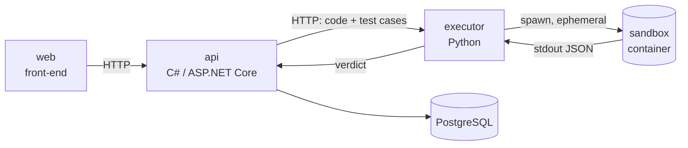

# leet-lingo

Gamified algorithm practice — solve a problem, get a verdict, keep your streak.

The product is the easy half. The engineering problem underneath it is this: **a stranger sends you code and you have to run it.** Not analyze it, not lint it — execute it, on your hardware, and hand back an honest answer about whether it passed. That constraint drives every decision in this repository.

## The hard part

Submitted code is hostile by default. Not because users are malicious, but because you cannot tell the difference between a user who is and a user who isn't until after you've run it.

A submission is assumed to be actively trying to read the host filesystem, open a socket, exhaust memory, spawn processes without limit, or simply never return. Each of those gets a specific countermeasure, and each countermeasure is tested against the attack it exists to stop — a test that runs a fork bomb and asserts the container died is worth more than a paragraph claiming it would.

| Threat | Countermeasure |
| --- | --- |
| Escape to host, persistence between runs | Ephemeral container, destroyed after every submission |
| Exfiltration, callbacks to a remote host | `--network none` — no interface exists to reach |
| Memory exhaustion, fork bombs | Hard memory and CPU limits at the container boundary |
| Tampering with the harness or the filesystem | Read-only root filesystem |
| Privilege escalation | Unprivileged user, no capabilities |
| Infinite loops | External timeout that kills the container from outside |

The last one matters more than it looks. A timeout enforced *inside* the sandbox is code the attacker controls. It has to be enforced by the process that owns the container, from the outside, where submitted code has no reach.

### Two images, not one

The executor service and the sandbox are separate Docker images, and conflating them would undo everything above.

The **service** image runs the HTTP layer: it holds the Docker client, the application dependencies, and access to the Docker socket. The **sandbox** image holds a bare Python runtime and nothing else — no HTTP library, no Docker client, no socket.

Build user code into the service image for convenience and the attacker wakes up inside a container that already has the tools to talk to the Docker daemon. The separation isn't organization; it's the security boundary.

## Architecture

Three services in one repository, orchestrated by Docker Compose at the root.

- **`/api`** — C# / ASP.NET Core. Users, problems, submissions, progress. Deliberately has **no** ability to execute code; it delegates to the executor over HTTP and stores the result.
- **`/executor`** — Python. Receives code and test cases, runs them in a throwaway container, returns a verdict. The only component that touches the Docker socket.
- **`/web`** — front-end. Later phase.

The boundary between the API and the executor is the one that would exist even in a single-language build: everything that touches hostile code lives on one side of an HTTP call, and the blast radius of a sandbox escape stops there. The languages on either side were chosen deliberately — C# and Python are the stacks this project sets out to practice.

Compose is the only orchestrator. No Nx, no Turborepo — those solve JavaScript monorepo problems, and this repository is polyglot and small.

### The harness

Users don't write a program, they write a function. A harness the platform controls imports that function, runs it against each test case, and prints a single JSON document to stdout. The parent process reads stdout and never trusts anything else — not exit codes alone, not stderr, not files the container claims to have written.

## Status

**July 2026 — early.** Nothing is running yet. The executor is being built first, in isolation, before any API or front-end exists.

- [ ] Spawn an ephemeral container from Python, run fixed code, capture output
- [ ] Test harness that runs a function against test cases and emits a verdict
- [ ] Security limits, each with a test that performs the attack it blocks
- [ ] HTTP contract between API and executor
- [ ] C# API — users, problems, submissions, progress
- [ ] Front-end

Built one piece at a time, each working in isolation before anything connects to it.

## Stack

| Component | Choice |
| --- | --- |
| Executor | Python |
| API | C# / ASP.NET Core, Minimal APIs |
| Persistence | Entity Framework Core |
| Isolation | Docker, ephemeral containers |
| Orchestration | Docker Compose |
| Submissions | Python only for v1; multi-language is v2 |

## Scope

This is a portfolio and learning project, not a product. It is built to demonstrate polyglot service architecture and safe execution of untrusted code, and it is optimized for those goals rather than for scale or feature breadth.
